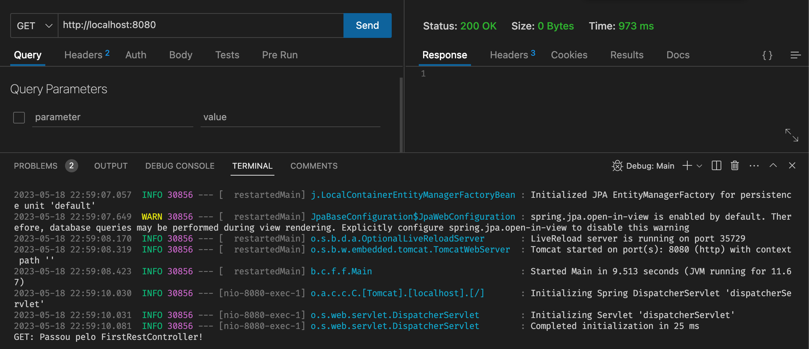
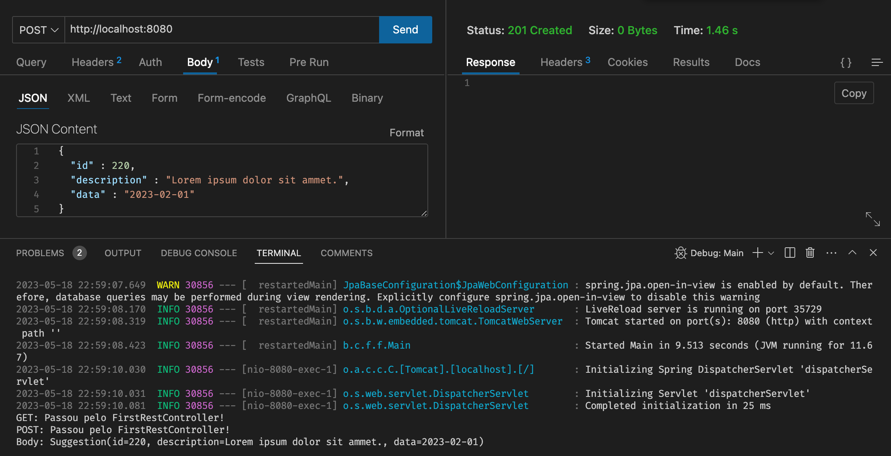
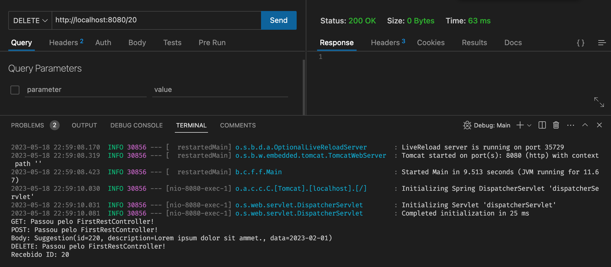
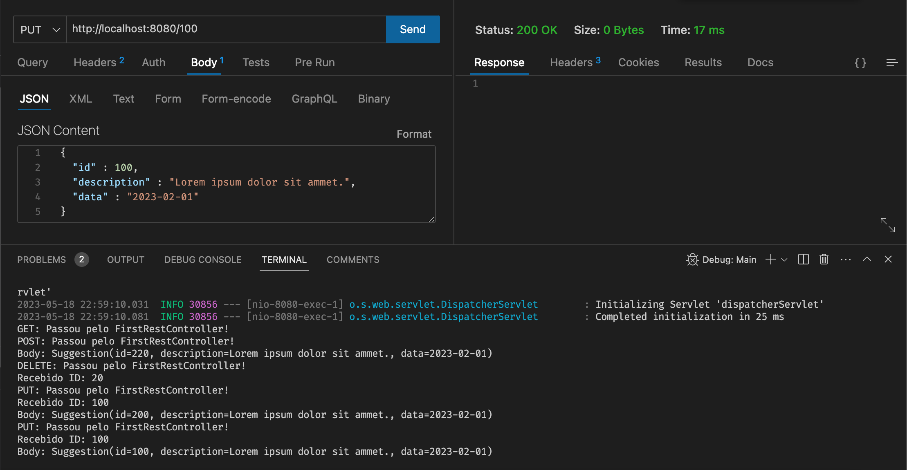
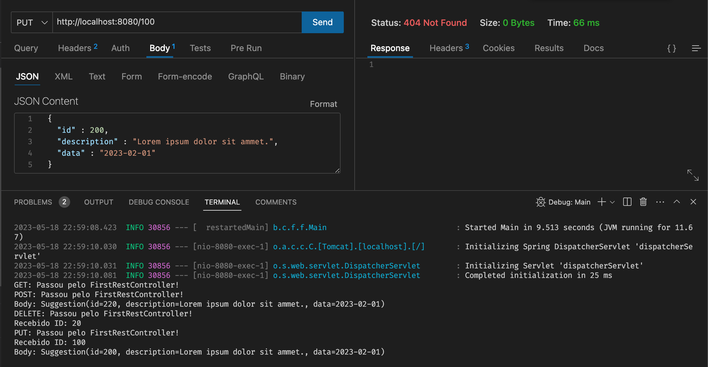
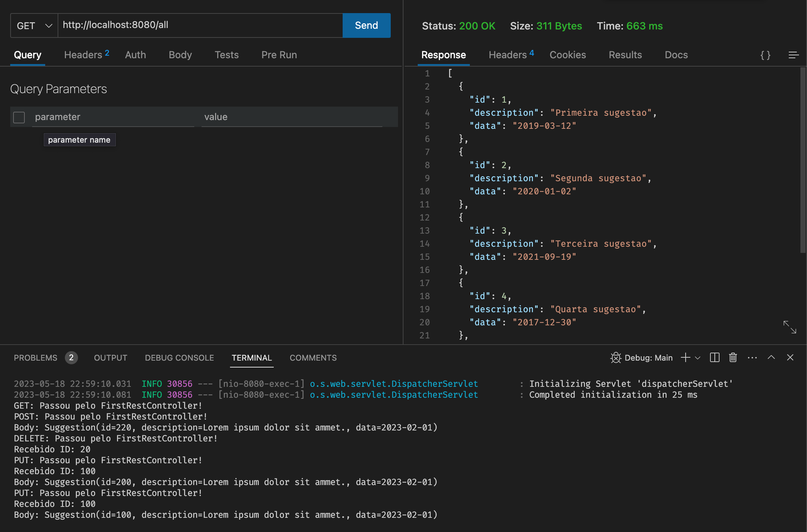

# f290_dsm_tp2_suggestionbox_ht

## SuggestionBox API

O objetivo deste tutorial é que consigamos repassar os princípios de uma API de forma 100% prática utilizando Spring Boot.

Como o foco de nossa disciplina é o aprimoramento de técnicas de progrmação de uso de padrões de projetos; iremos aprofundar nossos conhecimentos nas camadas `Model` e `Controller` e consequentemente a utilização de domain classes, services, utilities e conversores.

### Criação de Projeto

Para a utilizaão deste projeto iremos utilizar as seguintes dependencias do Spring Boot.

Dependência | Objetivo
-- | --
Web | Web Server TomCat com suporte à criação de WepApps e REST APIs
H2 | Banco de dados em memória para facilitar o desenvolvimento e os testes unitários
JPA | Framework para utilização de ORM e gerenciamento de entidades
MySQL | Driver de conexão para MySQL e/ou MariaDB
FlyWayDB | Framework para migrações em banco de dados, auxilia a criação e atualização de entidades
Validation | Facilita a validação de atributos durante requisições REST
Lombok | Facilitador para utilização de boilerplates como Getters, Setters, Equals, HashCode, toString, dentre outros
DevTools | Facilita a reinicialização do projeto ao ocorrerem alterações


> Caso você não utilize o VSCode com o plugin initializr, para facilitar a criação do projeto; crie o projeto na aplicação web [initializr](https://start.spring.io/) e abra-o na sua IDE favorita.

### Configuração dos Perfis

Neste projeto iremos iniciar sua utilização com a base de dados H2 e depois migrar para o MySQL.

Iremos criar 2 perfis, um para testes e um para desenvolvimento.

#### Perfil de Testes

Configure o perfil de testes:

1. Crie o arquivo `main\resources\aplication-test.properties`
2. Inclua o código abaixo no arquivo.
```properties
# H2
spring.datasource.url=jdbc:h2:mem:fatecdb
spring.datasource.driverClassName=org.h2.Driver
spring.datasource.username=aluno
spring.datasource.password=segredo
spring.jpa.database-platform=org.hibernate.dialect.H2Dialect

# JPA
spring.jpa.show-sql=true
spring.jpa.hibernate.ddl-auto=create
spring.jpa.properties.hibernate.format_sql=true
```

#### Perfil de Desenvolvimento

Configure o perfil de desenvolvimento:

1. Crie o arquivo `main\resources\aplication-dev.properties`
2. Inclua o código abaixo no arquivo.

```properties
# H2
spring.datasource.url=jdbc:mysql://localhost:3306/fatec
spring.datasource.username=root
spring.datasource.password=

# JPA
spring.jpa.show-sql=true
spring.jpa.hibernate.ddl-auto=none
spring.jpa.properties.hibernate.format_sql=true

```

#### Selecione o Perfil de Testes

No arquivo `aplication.properties` inclua o trecho abaixo para selecionar 1 dentre os 2 perfis.

```properties
server.port=8080
spring.profiles.active=test
```

> Para alterar para o perfil de desenvolvimento, apenas troque a palavra `test` por `dev`.

### Primeiro REST Controller

Incie o projeto e acesse a url `http://localhost:8080` para verificar se o servidor subiu corretamente.

Neste projeto não iremos utilizar a camada `VIEW` pois iremos trabalhar apenas com requisições `REST`, ou seja, iremos trabalhar respondendo à requisições sobre o protocolo HTTP com a representação dos dados em `JSON`.  

0. Crie a model class `model\Suggestion.java` para que possamos manipular os dado trafegados na API.

```java
@Data
@AllArgsConstructor
@NoArgsConstructor
public class Suggestion {
    private Integer id;
    private String description;
    private LocalDate data;
}
```

> O Lombok irá gerir o código boiler plate para facilitar o desenvolvimento com suas anotações.

1. Crie o pacote `\api\v1\resources`.
2. Crie a classe `FirstRestController.java` no pacote `resources`.
3. Inclua o trecho abaixo na classe para congigurar o REST Controller. As anotações `@RestController` e `@RequestMapping()`, configuram a classe para que elas possam capturar requisições REST em um determinado recurso provido pelas urls do servidor.

```java
@RestController 
@RequestMapping("/") 
public class FirstRestController {
    ...
}
```
4. Crie uma funcionalidade no controlador para responder à um pedido direto à raiz do servidor; uma requisição utilizando o método do tipo `GET` à raíz API.

```java
    @GetMapping
    public ResponseEntity<?> helloApiGet() {
        System.out.println("GET: Passou pelo FirstRestController!");
        return ResponseEntity.ok().build();
    }
```
5. Utilize o `Postman` ou o plugin `Thunder Client` para enviar as requisições para que a API possa responder às requisições da API.

Conforme o exemplo abaixo, confgure a requisição GET e execute a requisição.



> Observe o resultado da requisição com o `Status Code 200 - OK` sinalizando o sucesso a requisição.

6. Crie uma funcionalidade no controlador para responder à uma requisição utilizando o método do tipo `POST`.

```java
    @PostMapping
    public ResponseEntity<?> helloApiPost(@RequestBody Suggestion suggestion) {
        System.out.println("POST: Passou pelo FirstRestController!");
        System.out.println("Body: " + suggestion);
        return ResponseEntity.created(null).build();
    }
```

> A anotação @RequestBody faz com que a requisição obrigatoriamente contenha dados no corpo da requisição.

Conforme o exemplo abaixo, configure a requisição POST e execute a requisição.



> Observe o resultado da requisição com o `Status Code 201 - CREATED` sinalizando o sucesso a requisição.

7. Crie uma funcionalidade no controlador para responder à uma requisição utilizando o método do tipo `DELETE`.

```java
    @DeleteMapping("/{id}")
    public ResponseEntity<?> helloApiDelete(@PathVariable("id") Integer id) {
        System.out.println("DELETE: Passou pelo FirstRestController!");
        System.out.println("Recebido ID: " + id);
        return ResponseEntity.ok().build();
    }
```

> A anotação @PathVariable faz com que a requisição possa capturar dados diretamente, o id do recurso a ser excluído.

Conforme o exemplo abaixo, configure a requisição DELETE e execute a requisição.



> Observe o resultado da requisição com o `Status Code 200 - OK` sinalizando o sucesso a requisição.

8. Crie uma funcionalidade no controlador para responder à uma requisição utilizando o método do tipo `PUT`.

```java
    @PutMapping("/{id}")
    public ResponseEntity<?> helloApiPut(@PathVariable("id") Integer id,
            @RequestBody Suggestion suggestion) {
        System.out.println("PUT: Passou pelo FirstRestController!");
        System.out.println("Recebido ID: " + id);
        System.out.println("Body: " + suggestion);

        if (suggestion.getId().equals(100)) {
            return ResponseEntity.ok().build();
        }

        return ResponseEntity.notFound().build();
    }
```

> Nesta requisição iremos testar 2 códigos de resposta diferentes, 1 simulando sucesso na atualização e outro simulando a falha de atualização devido à não localizar o recurso solicitado na API.

Conforme o exemplo abaixo, configure a requisição PUT e execute a requisição.



> Observe o resultado da requisição com o `Status Code 200 - OK` sinalizando o sucesso a requisição.



> Observe o resultado da requisição com o `Status Code 404 - NOT_FOUND` sinalizando o sucesso a requisição.

9. Crie uma funcionalidade no controlador para responder à uma requisição utilizando o método do tipo `GET` com uma coleção de objetos como resposta.

```java
    @GetMapping("/all")
    public ResponseEntity<List<Suggestion>> getAll() {
        List<Suggestion> all = Arrays.asList(
                new Suggestion(1, "Primeira sugestao",
                        LocalDate.of(2019, 3, 12)),
                new Suggestion(2, "Segunda sugestao",
                        LocalDate.of(2020, 1, 2)),
                new Suggestion(3, "Terceira sugestao",
                        LocalDate.of(2021, 9, 19)),
                new Suggestion(4, "Quarta sugestao",
                        LocalDate.of(2017, 12, 30)),
                new Suggestion(5, "Quinta sugestao",
                        LocalDate.of(2016, 4, 16))
        );

        return ResponseEntity.ok().body(all);
    }
```

Conforme o exemplo abaixo, configure a requisição GET e execute a requisição.

> Observe o resultado da requisição com o `Status Code 200 - OK` sinalizando o sucesso a requisição assim como os dados de resposta contendo um array contendo objestos JSON.



# Concluímos a Primeira Parte

Até aqui consguimos utilizar os principais verbos utilizados numa API básica; espero que voce tenha compreendido os princípios básicos de uma API com Spring Boot.

# Parte II - Camada Model

Agora que já entendmos como capturar as requisições via REST Controllers; iremos preparar a camada model para além de persistir dados, aplicar as regras de negócio da API.

## Entities

Primeiramente iremos criar a entidade mais simples, a categoria. 
Após sua criação iremos criar um respositório e um serviço para encapsulá-lo e assim respnder às chamadas do controlador REST.

### Category Entity

No pacote `model/entities` crie a classe `Category.java`.

```java
@Data
@Entity(name = "categories")
public class Category {

    @Id
    @GeneratedValue(strategy = GenerationType.IDENTITY)
    private Integer id;

    @Column(nullable = false, length = 100, unique = true)
    private String description;
}
```

### CategoryRespository

No pacote `respositories` crie a classe `CategoryRepository.java`.


```java
@Repository
public interface CategoryRepository extends JpaRepository<Category, Integer> {
    
}
```

### CategoryService

No pacote `services` crie a classe `CategoryService.java`.

```java
@Service
public class CategoryService {
    
    private final CategoryRepository repository;

    public CategoryService(CategoryRepository repository) {
        this.repository = repository;
    }

    public void salvar(Category category) {
        repository.save(category);
    }
}
```

### CategoryResource

No pacote `api\v1\resources` crie a classe `CategoryResource.java`.

```java
@RestController
@RequestMapping("/category")
public class CategoryResource {

    private final CategoryService service;

    public CategoryResource(CategoryService service) {
        this.service = service;
    }

    @PostMapping("/new")
    public ResponseEntity<Void> save(@RequestBody Category category) {
        category.setId(null);
        service.salvar(category);
        return ResponseEntity.ok().build();
    }
}
```

# Challenge

1. Remover a opção de criar as entidades automaticamente do `aplication-test.properties` e substituir por `none`.
2. Criar um script que crie a entidade `category` e inclua 3 categorias.
3. Crie uma funcionalidade no controlador que responda à uma requsição no recurso `http://localhost/category/all` com um JSON que represente uma lista com todas as categorias cadastradas na base de dados.
4. Criar uma requisição no Postman/ThunderClient para o recurso `http://localhost/category/new` com o método `POST` contendo o corpo da requisição que inclua um registro na entidade `category`.
5. Verifique o registro na base de dados H2.


